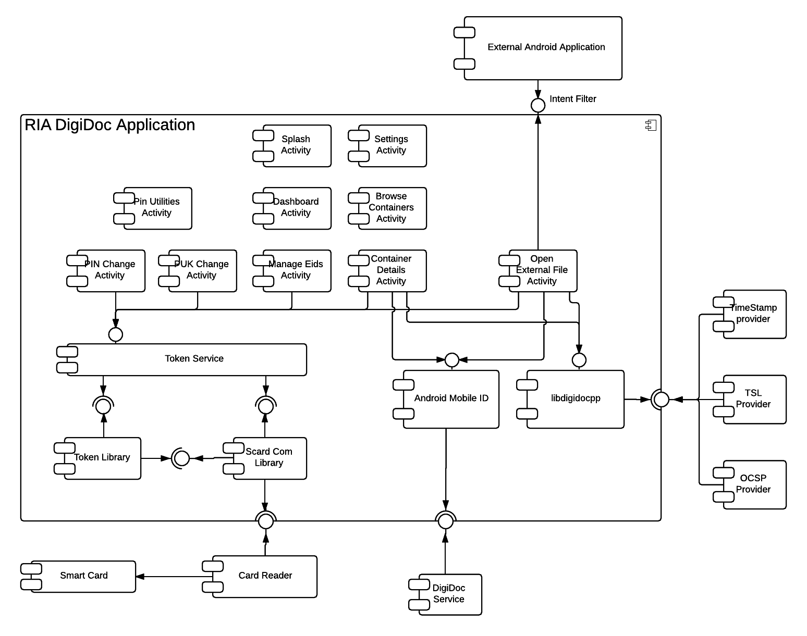

### RIA Digidoc Application

RIA DigiDoc is an android application that allows signing containers with ID card and Mobile ID. The following diagram and description depicts RIA DigiDoc Application on a component diagram.

#### Activities

| Activity | Description |
|------------------------------|--------------------------------------------------------|
| **Splash Activity** | Shown on application startup. Displays EU development fund logos and starts Dashboard Activity |
| **Dashboard Activity** | Displays a dashboard style menu and access to Container Details Activity, Browse Containers Activity, Manage Eids Activity and Pin Utilities Activity|
| **Browse Containers Activity** | Provides functionality to browse and search for saved containers. Launches Container Details Activity for selected container. Provides fuctionality to delete saved containers |
| **Container Details Activity** | Through shared fuctionality in Container Details Fragment it provides container management functionalities such as adding and removing data files, adding and removing signatures, sharing containers via Android built in sharing functionality, opening files added to the container. It uses **libdigidocpp** for container operations, **tokenservice** lib to create signatures with smart cards, **androidmobileid** to create signatures with Mobile-ID|
| **Manage Eids Activity** | Shows information on connected smartcard. Uses **tokenservice** to read information on smartcard and listens for Broadcasts from **scardcomlibrary** to determine wether a smartcard is connected|
| **Pin Utilities Activity** | Provides menu to access Pin and Puk Change Activities |
| **Pin Change Activity** | Provides Functionality to change PIN1 and PIN2 codes on smartcard. Uses **tokenservice** to change PINs and listens for Broadcasts from **scardcomlibrary** to determine wether a smartcard is connected |
| **Puk Change Activity** | Provides Functionality to change PUK code on smartcard. Uses **tokenservice** to change PUK and listens for Broadcasts from **scardcomlibrary** to determine wether a smartcard is connected |
| **Open External File Activity** | Accepts VIEW, SEND, SEND_MULTIPLE Intent Broadcasts from other applications to open Containers and other files external to DigiDoc application. Creates a new container or opens a container depending on which type of file is recieved. Through shared fuctionality in Container Details Fragment it provides container management functionalities such as adding and removing data files, adding and removing signatures, sharing containers via Android built in sharing functionality, opening files added to the container. It uses **libdigidocpp** for container operations, **tokenservice** lib to create signatures with smart cards, **androidmobileid** to create signatures with Mobile-ID|
| **Container Details Fragment** | Contains Shared functionality to manage containers. It is used by Container Details Activity and Browse External File Activity|

#### Components

| Component | Description |
|------------------------------|--------------------------------------------------------|
| **tokenservice**| Service library that provides smart card communication for DigiDoc Application. It uses **tokenlibrary** for smart card specification and commands. It uses **scardcomlibrary** to communicate with supported card readers. |
| **scardcomlibrary**| Provides interface for communicating with smartcard readers and has implementations for ACS smartcard readers. It is used by **tokenservice** |
| **androidmobileid**| Provides functionality to create signatures with Mobile-ID. It uses Local Intent Broadcasts to communicate with Activities in the Application process and [Retrofit2](http://square.github.io/retrofit/) to communicate with DigiDoc service to create Mobile-ID signatures |
| **libdigidocpp**| libdigidocpp is used for opening, creating and editing different types of containers. See the project Github [page](https://github.com/open-eid/libdigidocpp) for further details |

#### RIA DigiDoc Application interfaces

RIA DigiDoc Application accepts the following Intent actions:

* android.intent.action.VIEW
* android.intent.action.SEND
* android.intent.action.SEND_MULTIPLE

See more details on used Intent filters in [AndroidManifest](app/src/main/AndroidManifest.xml) file under OpenExternalFileActivity

### Token Service

Service library that provides smart card communication for DigiDoc Application. It uses **tokenlibrary** for smart card specification and commands. It uses **scardcomlibrary** to communicate with supported card readers.

#### Components

| Component | Description |
|------------------------------|--------------------------------------------------------|
| **tokenlibrary**| Contains specifications and commands for EstEID v3.4 and v3.5 smartcards. Is used by **tokenservice**|
| **scardcomlibrary**| Provides interface for communicating with smartcard readers and has implementations for ACS smartcard readers. It is used by **tokenservice** |

#### Token Service interfaces

Provides interface via callback objects to bound activities

### Token Library

Token library implements specification and commands for EstEid v3.4 and v3.5 smart cards. It uses SmartCardComChannel interface from **ScardComLibrary** for communication with supported smart cards

#### Components

| Component | Description |
|------------------------------|--------------------------------------------------------|
| **scardcomlibrary**| Provides interface for communicating with smartcard readers and has implementations for ACS smartcard readers. It is used by **tokenservice** |

#### Token Library interfaces

Provides:
* Java Interface - Token interface with methods that realize common activities

Requires:
* Java Interface - SmartCardComChannel from **ScardComLibrary**

### ScardComLibrary

ScardComLibrary provides interface for communicating with smartcard readers and has implementations for ACS smartcard readers. It is used by **tokenservice**

### Android Mobile ID

Android Mobile ID is an Android library that provides asynchronous signing with Mobile ID functionality through DigiDoc Service SOAP interface. Communication with DigiDoc application is realized through [local Intent Broadcasts](https://developer.android.com/reference/android/support/v4/content/LocalBroadcastManager.html)

#### Android Mobile ID intefaces

Accepts implicit Intent to MobileSignService.class with the following extras:

| key | value | required |
|------------------------------|--------------------------------------------------------|------------------------------|
| ee.ria.mopp.androidmobileid.CREATE_SIGNATURE_REQUEST | JSON representation of MobileCreateSignatureRequest object | yes |
| ee.ria.mopp.androidmobileid.ACCESS_TOKEN_PATH | Path to .p12 access token for DigiDoc Service | no |
| ee.ria.mopp.androidmobileid.ACCESS_TOKEN_PASS | .p12 access token password | no |

Locally (within same application process) broadcasts Intents with action: ee.ria.mopp.androidmobileid.MID_BROADCAST_ACTION
Response type is determined by intent extra with key ee.ria.mopp.androidmobileid.MID_BROADCAST_TYPE_KEY. In total there are 3 response types with their respective response objects:

| .MID_BROADCAST_TYPE_KEY Value & Response object key | Response object value | Description |
|------------------------------|------------------------------|------------------------------|
| ee.ria.mopp.androidmobileid.MID_CHALLENGE | JSON representation of MobileCreateSignatureResponse object | Contains 4 digit challenge from DigiDoc service |
| ee.ria.mopp.androidmobileid.CREATE_SIGNATURE_STATUS | JSON representation of GetMobileCreateSignatureStatusResponse object | Contains status info and signature if status is "SIGNATURE"  |
| ee.ria.mopp.androidmobileid.SERVICE_FAULT | JSON representation of ServiceFault object | Broadcast in case of an error, contains error code and reason |

Uses DigiDoc service SOAP actions:

* [MobileCreateSignature](http://sk-eid.github.io/dds-documentation/api/api_docs/#mobilecreatesignature)
* [GetMobileCreateSignatureStatus](http://sk-eid.github.io/dds-documentation/api/api_docs/#getmobilecreatesignaturestatus)

